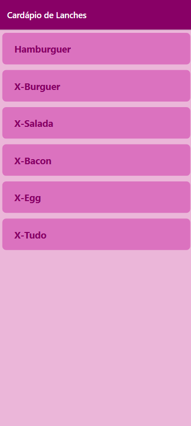
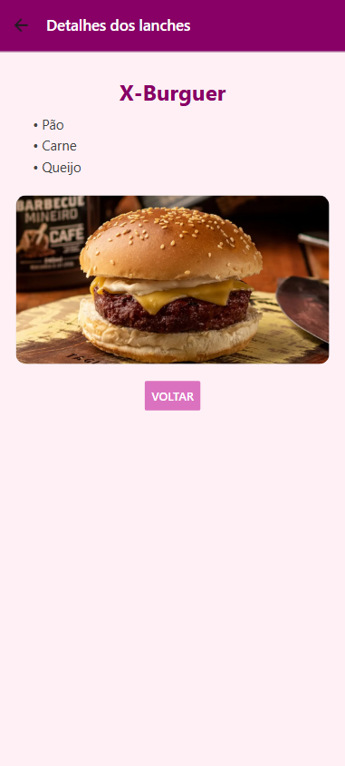

# Lanches👋
- Rebecaalimaa e thamyeS
- Aplicativo de estudo **Lista** e **detalhes**
- React Native + Expo
- <br>


## Passos para executar

1. Instale as dependências

   ```bash
   npm install
   ```

2. Inicie o App

   ```bash
   npx expo start
   ```